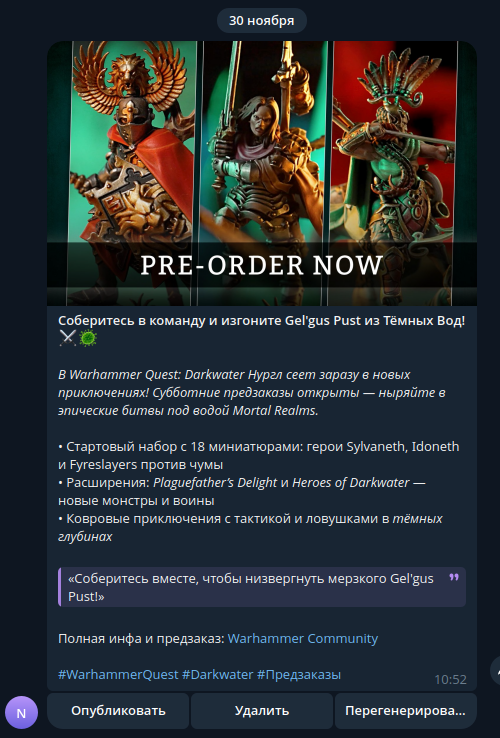

## Проект Новостной телеграмм бот

Проект представляет собой новостного тг бота для отправки новости в тг канал.
Работает следующим образом: бот берет информацию с определенного раздела сайта https://www.warhammer-community.com/en-gb/ путем
парсинга. Новость отправляется в нейросеть, на основе ссылки меняет/составляет новость для телеграм канала.
Новость передается в специального бота и там либо удаляется, либо перегенерируется, и отправляется в канал. Бот асинхронный.
проект коммерческий выставлен для портфолио 
### Пример новости


## Стек технологий
- Python 3.9+
- Telebot (pyTelegramBotAPI) - для работы с Telegram Bot API
- OpenAI API - для обработки новостей
- Httpx - асинхронные HTTP-запросы
- BeautifulSoup4 - парсинг HTML
- Docker - для контейнеризации

## Структура проекта
Проект состоит из нескольких основных файлов:
- `main.py` - главный файл для запуска бота
- `bot.py` - логика телеграм бота, обработка команд и модерация
- `parser.py` - парсинг новостей с сайта Warhammer Community
- `openai_client.py` - работа с OpenAI API для генерации текста
- `keyboards.py` - клавиатуры для телеграм бота
- `docker-compose.yml` и `Dockerfile` - конфигурация для Docker

## Установка и запуск

### 1. Установка зависимостей
```bash
pip install -r requirements.txt
```

### 2. Настройка переменных окружения
Создайте файл `.env` в корне проекта со следующим содержанием описано в env sample
```env
BOT_TOKEN=ваш_токен_бота_от_BotFather
OPENAI_API_KEY=ваш_ключ_openai_api
CHANNEL_ID=@ваш_канал_или_id
ADMIN_ID=ваш_id_в_telegram
```


### 3. Запуск через Docker
```bash

docker-compose up -d --build

```

### 4. Запуск без Docker
```bash

python main.py
```

## Важные замечания
1. Бот должен быть администратором в целевом канале
2. Убедитесь, что у вас есть доступ к API OpenAI
3. Парсинг происходит автоматически по временному интервалу 
4. Все новости проходят через панель модерации перед публикацией

---

## Требования
- Python 3.12 или выше
- Активный аккаунт OpenAI
- Telegram бот (создается через @BotFather)
- Telegram канал (бот должен быть администратором)

---

## Примечание
Проект использует библиотеку `telebot` (pyTelegramBotAPI) для работы с Telegram API.
Для асинхронной работы используется httpx и asyncio.

---

